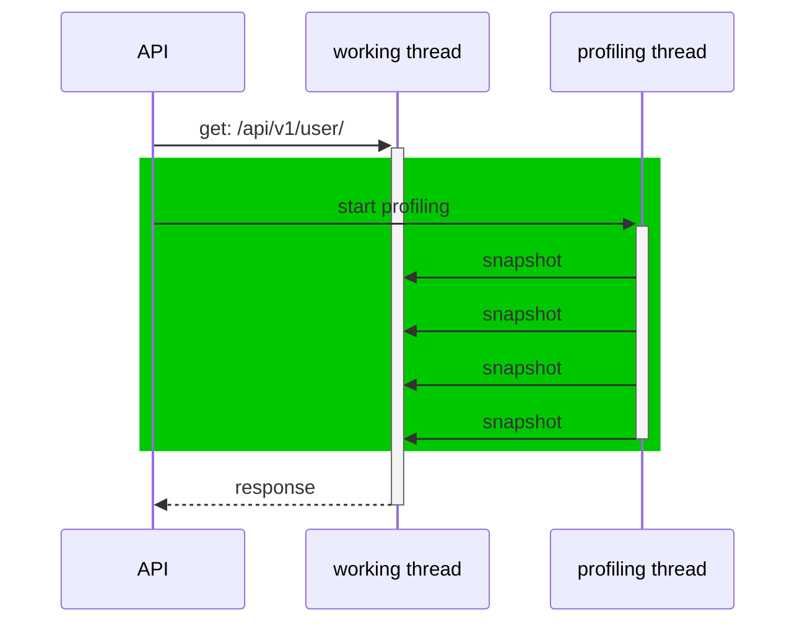
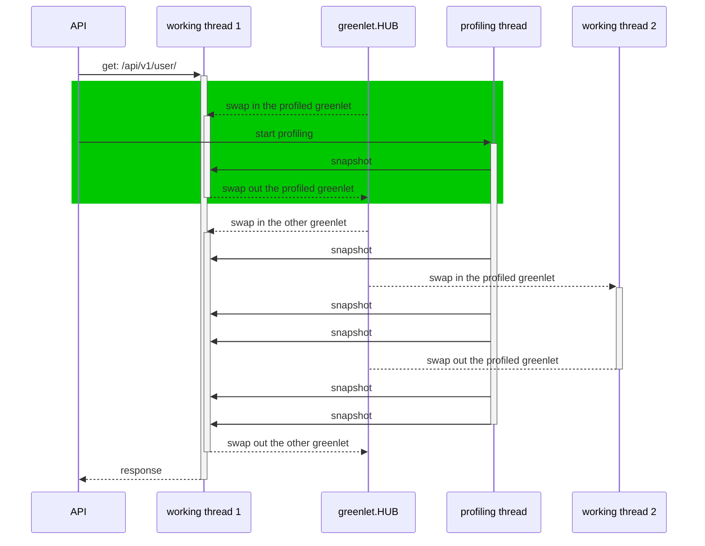
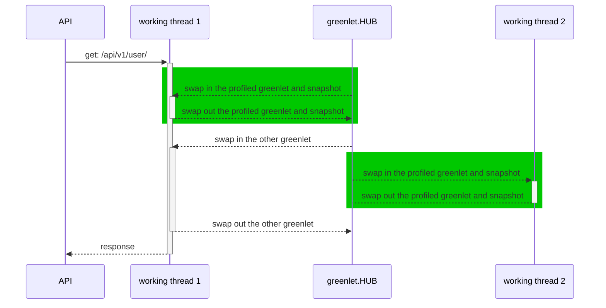

# How does threading-profiler (the default mode) work  

These blogs [skywalking-profiling](https://skywalking.apache.org/blog/2020-04-13-apache-skywalking-profiling/#profiling-in-production) and [skywalking-python-profiling](https://skywalking.apache.org/blog/2021-09-12-skywalking-python-profiling/) described how the threading-profiler works

And this figure demonstrates how the profiler works as well:

  

It works well with threading mode because the whole process will be executed in **the same** thread, so the profiling thread can fetch the complete profiling info of the process of the API request.

# Why doesn't threading-profiler work in greenlet mode
When the python program runs with gevent + greenlet, the process would be like this:

  

In this circumstance, the snapshot of the working thread includes multi contexts of different greenlets, which will make skywalking confused to build the trace stack.

Fortunately, greenlet has an API for profiling, the doc is [here](https://greenlet.readthedocs.io/en/latest/tracing.html). We can implement a greenlet profiler to solve this issue.

# How the greenlet profiler works

A greenlet profiler leverages the trace callback of greenlet, it works like this:

We can set a callback function to the greenlet that we need to profiling, then when the greenlet.HUB switches the context in/out to the working thread, the callback will build a snapshot of the greenlet's traceback and send it to skywalking.

# The difference between these two profilers

The greenlet profiler will significantly reduce the snapshot times of the profiling process, which means that it will cost less CPU time than the threading profiler.
